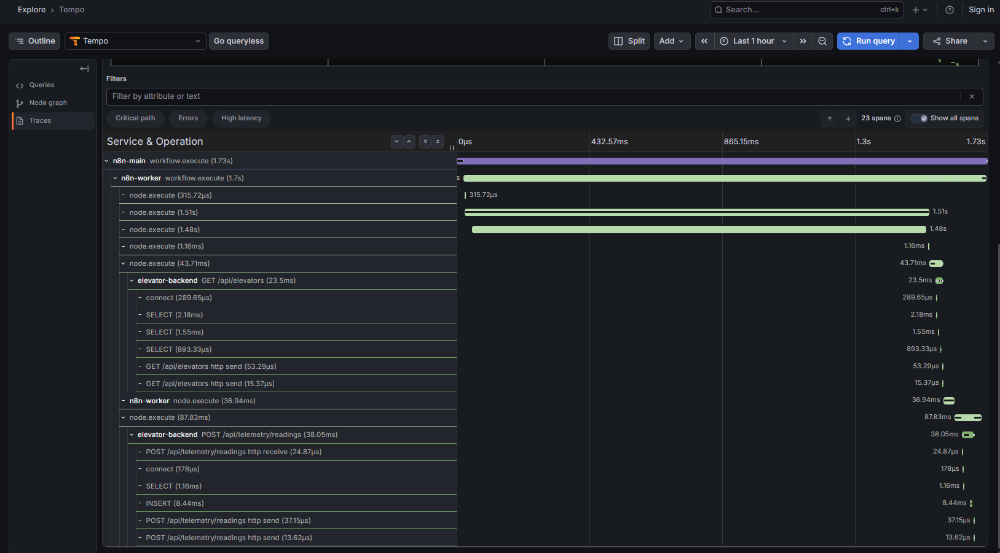

# Orchestration

n8n owns the schedules this system used to lack. Two workflows, each with a
Schedule Trigger for the local stack and a Webhook Trigger for production:
telemetry ingest, and a daily re-scoring that also carries a manual trigger.

## What runs where

| | Local | Production |
|---|---|---|
| Where n8n runs | `n8n` (+ `n8n-worker` in queue mode) in `docker-compose.yml` | The `elevator-orchestrator` AWS Lambda function: one short-lived n8n per invocation |
| Who triggers | The workflows' own Schedule Triggers | EventBridge Scheduler, through each workflow's Webhook Trigger |
| Ingest cadence | every 15 minutes | every 30 minutes |
| Re-score | daily 06:00 Europe/Madrid, or the Manual Trigger | daily 06:00 Europe/Madrid |
| Editor, execution history | yes, on :5678 | **none** — a fresh SQLite per invocation; the result is in the function's log |
| Scorer | the `inference` container (`INFERENCE_URL`) | the `elevator-scorer` Lambda (`INFERENCE_LAMBDA_FUNCTION`) |
| Traces | Collector → Tempo (and Grafana Cloud with the overlay) | straight to Grafana Cloud, traces only |

**The production host runs no orchestrator and no scorer.** The `t3.micro`
serves `db`, `migrate`, `backend`, `frontend` and `nginx`, exactly as before;
`test_prod_compose_defines_no_orchestrator` keeps it that way. n8n alone peaks
near 1 GB, which that host does not have, and it holds the ingest token and
model-provider access, which do not belong on a public web host.

The local stack is still the **edge-collection shape** worth naming: readings
produced close to the asset and pushed to a central service, with the
orchestrator owning the trigger. In a real fleet the ingest half would run per
site and only scoring would be central; running both from one function is a
simulation artefact, not a design position.

## Production: one invocation, one workflow

`orchestrator/` builds the function's container image from the same pinned
`n8nio/n8n:2.37.6`. The workflows are seeded at build time — imported and
published into a SQLite database, with every Schedule Trigger **disabled** so
only EventBridge decides when work runs — next to credential placeholders whose
secret fields are empty.

Each invocation (`{"workflow": "telemetry-ingest"}` or
`{"workflow": "daily-inference-and-digest"}`):

1. refuses an unknown workflow before anything starts;
2. reads the ingest token and the Grafana Cloud OTLP settings from SSM (cached
   per sandbox) and fails, naming the parameter, if the token is missing;
3. copies the seed to `/tmp`, starts `n8n start` with the secrets in the child's
   environment only (`CREDENTIALS_OVERWRITE_DATA`, `N8N_OTEL_EXPORTER_OTLP_*`);
4. waits for `/healthz/readiness` to answer 200 **with JSON**;
5. POSTs `{"invocationId": <Lambda request id>}` to the workflow's webhook and
   requires 200 + JSON back;
6. sends SIGTERM and **waits for n8n to exit** — on success and on failure —
   then logs the workflow's output (the digest lives there) and one CloudWatch
   EMF line (`Elevator/Orchestrator` · `WorkflowSucceeded`, `WorkflowDegraded`).

Measured under the Lambda RIE at 2048 MB: ~24 s per invocation, ~0.9–1.1 GB
peak, which is ~71k GB-s a month — about 18 % of the free tier. The
`elevator-lambda-daily-gbs` alarm fires at 70 % of the free tier's daily pace.

### Traps the spike found, and where each is handled

Each fails **silently** if ignored. All are in `orchestrator/runtime/lib.mjs`
or the image build, and each has a test.

| Trap | Handling |
|---|---|
| `n8n execute` loads no OTel module and cannot start from a Schedule Trigger | `n8n start` + a Webhook Trigger |
| `/healthz` answers 200 long before workflows are active; the webhook then answers **200 "n8n is starting up"** | poll `/healthz/readiness`, require a JSON body from both |
| `CREDENTIALS_OVERWRITE_DATA` only fills **empty** fields | placeholders hold `""`; the image test asserts it |
| A missing token makes n8n send an empty header and the execution still "succeeds" | the handler refuses to start n8n without it |
| Spans are exported in n8n's shutdown hook; Lambda freezes the sandbox on return | SIGTERM and await exit before returning; `spansFlushed` is in the result |
| An n8n left alive in a reused sandbox answers the next readiness probe | stop in `finally`, on every path |
| A fresh database numbers every execution `1` | HTTP nodes send the webhook's `invocationId` as `X-N8N-Execution-Id` |
| Role credentials are temporary | the `aws` placeholder has `temporaryCredentials: true`; the overwrite carries `sessionToken` |
| n8n 2.x blocks `$env` in expressions, and a blocked read **fails** the execution | `N8N_BLOCK_ENV_ACCESS_IN_NODE=false` in the image and in `docker-compose.yml` |

### Running the production shape locally

The workflows' webhooks also work on the local stack, which is the quickest way
to exercise the production trigger path:

```bash
curl -X POST localhost:5678/webhook/telemetry-ingest \
  -H 'content-type: application/json' -d '{"invocationId":"local-test-1"}'
```

The backend span then carries `n8n.execution.id = local-test-1`. To run the
function image itself, use the Lambda Runtime Interface Emulator with a
read-only root filesystem and only `/tmp` writable, as in
`openspec/changes/archive/*-serverless-n8n-orchestration/reports/`.

Production is unreachable from the **local** workflows: they address
`http://backend:8000` unless `ELEVATOR_API_BASE_URL` is set, and only the
Lambda image sets it.

## The stack

| Service | Role |
|---|---|
| `n8n` | Main process, editor on :5678, owns the schedules |
| `n8n-db-init` | One-shot; creates the `n8n` database on the existing PostgreSQL |
| `redis` | Queue backend — `queue` profile only |
| `n8n-worker` | Executes workflows in queue mode — `queue` profile only |

```bash
docker compose up -d                                        # regular mode
N8N_EXECUTIONS_MODE=queue docker compose --profile queue up -d   # queue mode
```

Queue mode is one variable and a profile flag, not a rewrite. That was the point
of writing the compose in queue-mode shape from the start — and **both halves are
required**. Compose cannot make the profile imply the mode, so
`docker compose --profile queue up -d` without the variable starts a main
process in regular mode that executes everything, plus an idle worker whose
scrape target still reads `up`. Nothing reports the mismatch.

**The `n8n` database is created by a one-shot service, not by
`docker-entrypoint-initdb.d`.** That recipe runs only when the data directory is
empty, and `postgres_data` already has data on any machine that has run this
project before — so it silently never runs and n8n fails at startup with
"database n8n does not exist".

## Configuration that is easy to get wrong

Every item here fails **silently**. Each was found by running the stack, not by
reading documentation, and each is quoted from the running image rather than
remembered.

| Setting | Why it matters |
|---|---|
| `N8N_ENABLED_MODULES: otel` | OTel ships as an n8n *module* and the enabled list defaults to empty. Without this, `N8N_OTEL_ENABLED` configures a module that was never loaded. Nothing is logged. |
| `N8N_OTEL_ENABLED: "true"` | Defaults to `false`. |
| `N8N_OTEL_EXPORTER_SERVICE_NAME` | **Not** `N8N_OTEL_SERVICE_NAME`, which n8n does not read — the wrong spelling is ignored and the service appears in Tempo as the default `n8n`. |
| `N8N_OTEL_TRACES_PRODUCTION_ONLY: "false"` | Defaults to `true`. The editor's "Test workflow" button is a *manual* execution and exports zero spans, so iterating in the editor looks exactly like tracing being broken. **Verify linkage with an activated workflow.** |
| `N8N_ENCRYPTION_KEY` | Must be identical on main and every worker, or workers cannot decrypt credentials and every node using one fails with an error that never mentions encryption. |
| The whole OTel block | Must be identical on main and every worker. In queue mode the worker runs the executions; configured on main alone it emits nothing, and the result is a parent span with no children — which reads as "the workflow never ran". |
| `N8N_AGENTS_TRACING_RECORD_INPUTS/OUTPUTS` | Both default to `true` and would ship prompts and model output to Grafana Cloud. |

`tests/unit/test_dev_compose.py` asserts the encryption key and the OTel block
match across main and worker, because "they read the same variable" stops being
true the moment someone gives one of them its own value.

## Metrics

Scraped by the Collector from both processes, labelled `n8n_role`. The names in
2.37.6 are not the ones the documentation-era dashboard assumed:

| Metric | Notes |
|---|---|
| `n8n_workflow_execution_duration_seconds_count` | Executions. Carries `status` and `mode` labels. |
| `n8n_scaling_mode_queue_jobs_waiting` / `_active` / `_completed` / `_failed` | Queue depth. **Main only, and only in queue mode** — gated in `queue-metrics.service.js` on `includeQueueMetrics && mode === 'queue' && instanceType === 'main'`. |
| `n8n_active_workflow_count`, `n8n_instance_role_leader` | Fleet-level state. |

Workflow-id and node-type labels are **off**. One careless label on a 100-lift
fleet is what a 10k-series free tier is lost to.

`n8n_instance_ai_*` looks like agent telemetry and is not — it belongs to n8n's
own "instance AI" feature and stays at zero through a successful AI Agent run.
A dashboard panel was built on it and removed.

With the `queue` profile down, the worker target does not resolve and the
Collector logs a scrape warning every 15 seconds. The resulting
`up{n8n_role="worker"} == 0` is truthful, but the log noise has a cost: the
Collector's own log is where a silently failing Grafana Cloud exporter shows up.
If the profile is going to be down routinely, move the worker target to a
queue-profile-only Collector config.

## Traces

n8n injects W3C `traceparent` into outbound HTTP, and the backend continues it,
so a scheduled execution is one trace from the orchestrator through the API to
the database. This needs no code — just don't override `OTEL_PROPAGATORS`.

`app/core/orchestration_context.py` additionally stamps `X-N8N-Execution-Id` and
`X-N8N-Workflow-Id` onto the server span, so a failed execution can be reached
from a trace even if header injection is off.

**The Tempo service graph will not show the `n8n → backend` edge, and this is
not a misconfiguration.** n8n emits no CLIENT-kind spans — verified with
`{resource.service.name="n8n-worker" && kind=client}`, which matches nothing —
and Tempo builds service-graph edges by pairing a CLIENT span with the SERVER
span it called. With no client side, the backend's server span is attributed to
the pseudo-node `user`, alongside plain `curl` traffic. The trace itself is
correctly linked; only the graph's edge inference cannot see it. Use the trace
view to show the hop.

In production there is no Collector: the function sets
`N8N_OTEL_TRACES_INCLUDE_NODE_SPANS=false`, so node spans are never produced.
Locally, on the Grafana Cloud pipeline only, a `filter` processor drops n8n's
per-node `node.execute` spans: n8n emits one per node execution, and at a 15-minute
schedule they are most of the volume. They stay in the local backend, where they
are what makes a slow or failing node visible.

## The distributed trace



One scheduled execution, 23 spans: `n8n-main` starts the workflow, `n8n-worker`
runs the nodes, and two of them open server spans on `elevator-backend` —
`GET /api/elevators` and `POST /api/telemetry/readings` — each with its own
`SELECT` and `INSERT` against Postgres beneath it.

No code makes this happen. n8n injects a W3C `traceparent` into outbound HTTP
and the backend continues it; the whole hop is configuration.

## The workflows

See [`n8n/workflows/README.md`](../n8n/workflows/README.md) for what each does
and how to import one. Two properties are load-bearing and easy to break:

- **`recorded_at` is stamped in the Code node, not the HTTP node.** n8n retries a
  failed node by re-running *that* node with the same input, so a timestamp
  computed upstream survives the retry and the backend recognises the batch as
  the same readings. Computed downstream, every retry would be a new batch and
  would weigh twice in the window average the risk score is built from.
- **The agent invents a scenario; a Code node generates the numbers.** A model
  asked for "a machine temperature" answers 300 on some runs and 27 on others,
  and both survive the ingest endpoint's validation.

**What the retry guarantee does and does not cover.** It covers node-level retry
— `retryOnFail`, which re-runs the failed node with the same input, so the
`recorded_at` computed upstream is carried into the retry unchanged. Verified by
forcing an HTTP node to fail once: both attempts submitted an identical
timestamp.

It does **not** cover *"Retry execution → from the beginning"* in the n8n UI.
That re-runs the Code node, which mints a fresh `recorded_at`, so the readings
are new identities and are stored. The backend is not wrong to store them — they
are a genuinely new sample by the identity rule — but a run retried that way
does contribute a second set of readings to the same window. Retry the failed
node, not the execution.

## Generated telemetry and what it is worth

The generator mirrors `_synthesise_features` in
`backend/ml/generate_predictions.py` — the function that produced the committed
`predictions.json` — so online and offline scoring see the same feature space.
The scenario the agent invents is constrained to that space: ambient temperature
23–31 °C, because the model was trained on `gauss(300 K, 2)` and anything
outside that band is extrapolation rather than prediction.

**Known limitation, and worth understanding before reading anything into a
demo.** At this operating point the model's risk is not driven by a lift's age or
usage. Speed sits at the 1168 rpm floor for any lift with torque above ~23 Nm, so
AI4I's heat-dissipation rule (rise < 8.6 K with speed < 1380 rpm) gates almost the
whole fleet, and which lifts are flagged follows the torque and temperature draw.
`predictions.json` has the same property: ELV-001 scores 0.7999 there because its
torque draw was 9.5 Nm, not because it is 25 years old.

Conditioning the generated dispersion on consumed motor life was tried, to make
risk follow condition. It moved the variance and did not change which lifts were
flagged, and it was reverted. Making risk track machine condition is a modelling
question, not a generator one, and inventing the correlation in synthetic data
would dress up the demonstration rather than drive it.
