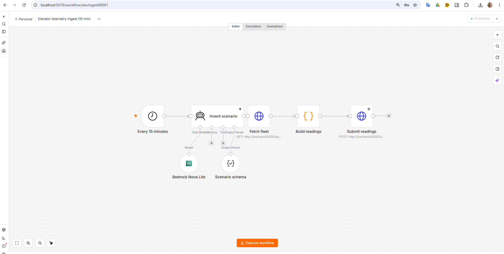
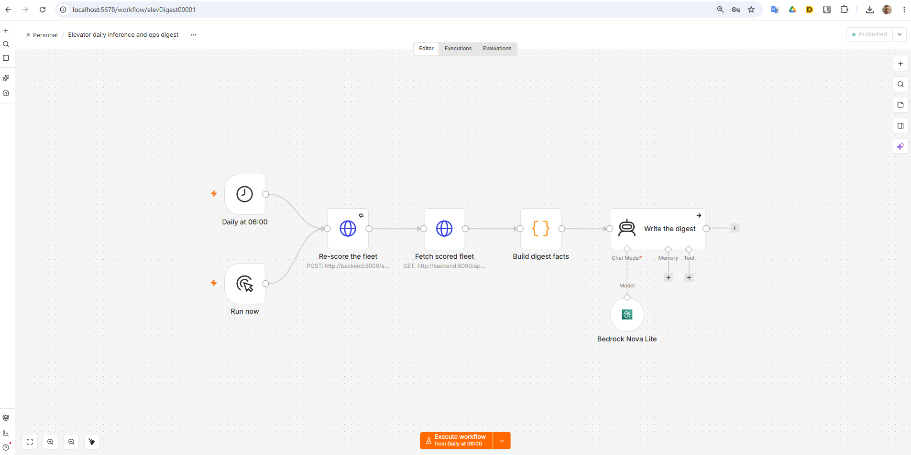

# n8n workflows

Exported definitions for the orchestration tier. They run **locally only** —
schedules fire while the development stack is up, and production carries no
orchestrator. See `docs/orchestration.md`.

Every file here is produced by `scripts/export-n8n-workflow.sh`, which strips
credential blocks, `meta.instanceId`, `versionId` and pinned data, and forces
`active: false`. Do not hand-edit an export and do not commit one taken any
other way.

## `telemetry-ingest.json`



`Schedule (15 min) → AI Agent → GET /api/elevators → Code → POST /api/telemetry/readings`

Generates one telemetry reading per in-scope lift and submits it as a batch.

**The agent invents a scenario; the Code node generates the numbers.** The agent
returns one small typed object through a Structured Output Parser — an ambient
temperature in Celsius, a load factor, a one-line narrative — and nothing else.
Every per-lift number is derived from it in code.

That split is not stylistic. A model asked directly for "a machine temperature"
answers `300` on some runs and `27` on others, and both survive the ingest
endpoint's validation. Constraining it to a scenario keeps the AI-orchestration
story and removes that whole class of silent corruption.

Two properties the Code node exists to hold, both load-bearing:

- **`recorded_at` is stamped in the Code node, never in the HTTP node.** n8n
  retries a failed node by re-running *that* node with the same input, so a
  timestamp computed upstream survives the retry unchanged and the backend
  recognises the batch as the same readings. Computed downstream, every retry
  would be a new batch and would weigh twice in the window average the risk
  score is built from.
- **The distributions mirror `_synthesise_features`** in
  `backend/ml/generate_predictions.py`. A first version used a torque band of
  8 Nm and near-constant rpm, and the fleet came back with 68 of 70 lifts scored
  `0.0000` — the model was shown one operating point wearing seventy names. The
  fix was to match the offline synthesis: torque with σ≈10 around
  `40 + floor_count × 0.3`, and speed derived from torque at roughly constant
  power. Fleet score variance went from `0.000000` to `0.042407`, and from 2
  distinct scores to 25.

The agent node has `onError: continueRegularOutput`, and the Code node falls
back to a fixed scenario if the agent returns nothing usable. Bedrock being
unavailable degrades the variety of the data; it does not stop the pipeline.

### Credentials to attach after importing

| Node | Credential type | What it needs |
|---|---|---|
| `Bedrock Nova Lite` | AWS | An IAM user with the `ElevatorBedrockInvokeNova` policy |
| `Submit readings` | Header Auth | `X-Ingest-Token` = the backend's `TELEMETRY_INGEST_TOKEN` |

`scripts/n8n-bootstrap-credentials.sh` creates both from the git-ignored root
`.env`, which is less error-prone than retyping them in the editor: a mistyped
ingest token surfaces as an HTTP 401 inside a node, which reads like a backend
fault.

## `daily-inference-and-digest.json`



`Schedule (06:00 Europe/Madrid) + Manual Trigger → POST /api/inference/run → GET /api/elevators → Code → AI Agent`

Both triggers feed the same chain, so a demonstration never waits for 06:00.

The Code node computes every figure the digest is allowed to mention — the level
counts, the top five by score, and the run's own skip counts — and the agent is
told to use only what it is given. Nothing in the output is the model's own
arithmetic.

It filters out lifts with no score before sorting. A lift the run skipped for
having no telemetry is a first-class outcome of that very run, and without the
filter the digest throws on exactly the day it has something interesting to say.

### Credentials to attach after importing

| Node | Credential type | What it needs |
|---|---|---|
| `Bedrock Nova Lite` | AWS | An IAM user with the `ElevatorBedrockInvokeNova` policy |
| `Re-score the fleet` | Header Auth | `X-Ingest-Token` = the backend's `TELEMETRY_INGEST_TOKEN` |

## Importing one of these

```bash
./scripts/n8n-bootstrap-credentials.sh                                   # once
./scripts/n8n-import-workflow.sh n8n/workflows/telemetry-ingest.json --activate
```

**Use that script rather than `n8n import:workflow` directly.** The export
deliberately strips credential blocks, so a raw import leaves the HTTP and model
nodes with nothing to authenticate with and the workflow fails at execution with
`Credentials not found` — an error that says nothing about the export having
done its job correctly. `n8n-import-workflow.sh` maps node types back onto the
credential ids `n8n-bootstrap-credentials.sh` creates, and restarts n8n, because
CLI activation does not take effect until it does.

The `id` field is kept in the export on purpose: n8n's importer requires one and
fails on a NOT NULL constraint without it. The ids here are fixed literals
chosen for this repository, not instance-generated, so they leak nothing.

## Verifying a workflow actually traced

Use an **activated** workflow, never the editor's "Test workflow" button.
`N8N_OTEL_TRACES_PRODUCTION_ONLY` defaults to `true`, and a manual execution
exports zero spans — which looks exactly like tracing being broken.
`docker-compose.yml` sets it to `false` for development, but the habit is worth
keeping: activation is what the production path does.
