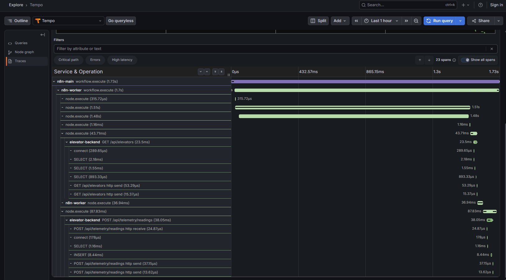

# Change: n8n-workflow-orchestration

| | |
|---|---|
| **Status** | Archived — 2026-09-01 |
| **Milestone** | M5 — Observability & Orchestration (change 3 of 3) |
| **Notion task** | [n8n workflow orchestration (self-hosted, queue mode)](https://app.notion.com/p/3ca3ada00a9581ecb0bcf606e3ef4814) |
| **Branch** | `feature/n8n-workflow-orchestration`, from `main` |
| **Reviews** | Independent cold-start session, 2026-09-01: **FAIL**, 6 Major. All addressed — see `reports/` |
| **Started** | 2026-08-31 |

## Summary

Adds the scheduler this system has never had: self-hosted n8n in queue-mode
shape, two workflows on two trigger types, native OpenTelemetry tracing on every
process, and Prometheus metrics that finally answer the orchestration dashboard
shipped in change 1. Last of the three changes in milestone M5.

## What it depends on

`harden-telemetry-ingest` (PR #33, merged 2026-08-31). The workflows send the
`X-Ingest-Token` it made the write endpoints check, and they depend on its
ingest idempotency: n8n retries a failed node by re-sending the same payload,
and without an identity for a reading a retried batch would weigh double in the
window average. Step 9 proves that end to end rather than assuming it.

## The three things most likely to waste an afternoon

Recorded here because each is silent, and two of them look like the feature
being broken when it is working:

1. **`N8N_OTEL_TRACES_PRODUCTION_ONLY` defaults to `true`.** The editor's "Test
   workflow" button is a *manual* execution and exports zero spans. Verify
   linkage with an **activated** workflow.
2. **The OTel block must be identical on main and every worker.** Configured on
   main alone, the worker executes everything and emits nothing — a parent span
   with no children, which reads as "never ran".
3. **`docker-entrypoint-initdb.d` will not create the `n8n` database.** It runs
   only on an empty data directory, and `postgres_data` already has data
   everywhere. Hence the one-shot `n8n-db-init` service.

## What this deliberately does not claim

The orchestration tier runs locally. Schedules fire while the stack is up; this
is not an autonomous pipeline, and every artifact says so. Moving the
orchestration tier to the cloud is recorded as future work, not quietly faked.

## Deliverables

23 spans in one trace: `n8n-main` starts the workflow, `n8n-worker` runs the
nodes, and two of them open server spans on `elevator-backend`, each with its own
`SELECT` and `INSERT` beneath. Canvas screenshots for both workflows are in
`n8n/workflows/`.

The Tempo **service graph** deliberately does not show this hop: n8n emits no
CLIENT-kind spans, and the graph builds edges by pairing CLIENT with SERVER. The
trace is linked correctly; only the graph's edge inference cannot see it.

## Artifacts

- [proposal.md](./proposal.md)
- [design.md](./design.md)
- [tasks.md](./tasks.md)
- [specs/workflow-orchestration/spec.md](./specs/workflow-orchestration/spec.md)
- [specs/observability/spec.md](./specs/observability/spec.md)
- [reports/2026-09-01-adversarial-review-independent.md](./reports/2026-09-01-adversarial-review-independent.md)
